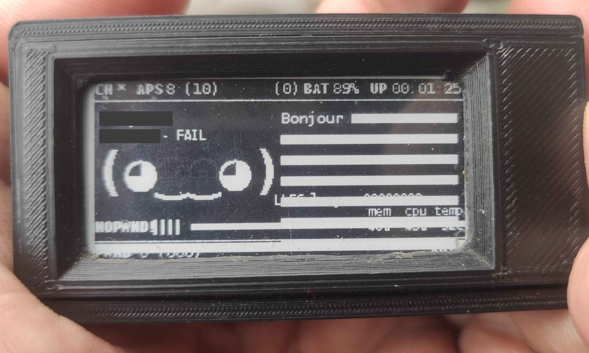

# PwngridSpam Attack

## Description
Welcome to the ESP-32 PwngridSpam Attack project! 

This standalone ESP-32 attack is designed to spam face and name on all pwnagotchi devices nearby and can be used to causing a DoSPWND (Denial Of Screen PWND part). 

Perfect for showcasing at events like DEFCON.😜

It's also available on the Evil-M5Project : https://github.com/7h30th3r0n3/Evil-M5Core2

## Demo
<div align="center">
   Thx to sasquatch !!! 💕</br>
    <a href="https://www.youtube.com/watch?v=YbbKXiaOUAA&t=181s">
        
    </a>
</div>

 <div align="center"> 
    
 </div>

## Installation
To set up the project, follow these steps:

1. **Download the Code:**
   Download the provided code files to your local machine.

2. **Install dependencies:**
   Ensure you have the necessary libraries installed in your Arduino IDE.

3. **Upload the code:**
   Use the Arduino IDE to flash the provided code to your ESP-32 device.

## Usage
Once the code is uploaded to your ESP-32 it's start spamming automatically and you can control the beacon transmissions via serial commands:

- **Start regular beacon transmission:**
    ```sh
    start
    ```

- **Stop beacon transmission:**
    ```sh
    stop
    ```

- **Start PWND beacon transmission:**
    ```sh
    dospwnd
    ```

- **Stop PWND beacon transmission and start regular beacon transmission:**
    ```sh
    stopdospwnd
    ```
- **Start/Stop Flood peer beacon :**
    ```sh
    randomid
    ```
    
### Serial Command Guide
- `start`: Begin regular beacon transmission.
- `stop`: Halt all beacon transmissions.
- `dospwnd`: Initiate DoSPWND mode beacon transmission .Can be used with randomid.
- `stopdospwnd`: Cease PWND mode and resume regular beacon transmission.
- `randomid`: Initiate Flood peer mode. Can be used with dospwnd.
  
## Features
- **Beacon Spam:** Transmit custom faces and names to pwnagotchi devices.
- **DoSPWND Mode:** Special mode to block pwnagotchi screens.
- **Serial Control:** Easy control through serial commands.
- **Event Ready:** Ideal for live demonstrations at hacking events.

## License
This project is licensed under the MIT License. See the `LICENSE` part for details.

## Credits
Special thanks to the open-source community and all contributors.

---

Bring this project to your next hacking event and demonstrate the power and flexibility of the ESP-32 in a fun and interactive way.

Perfect for engaging with fellow hackers and showcasing innovative uses of Wi-Fi technology.

## MIT License

Copyright (c) [2024] 7h30th3r0n3

Permission is hereby granted, free of charge, to any person obtaining a copy
of this software and associated documentation files (the "Software"), to deal
in the Software without restriction, including without limitation the rights
to use, copy, modify, merge, publish, distribute, sublicense, and/or sell
copies of the Software, and to permit persons to whom the Software is
furnished to do so, subject to the following conditions:

The above copyright notice and this permission notice shall be included in all
copies or substantial portions of the Software.

**In addition, all copies or substantial portions of the Software must give
appropriate credit to the original author by linking to the original repository
and mentioning the author's name.**

THE SOFTWARE IS PROVIDED "AS IS", WITHOUT WARRANTY OF ANY KIND, EXPRESS OR
IMPLIED, INCLUDING BUT NOT LIMITED TO THE WARRANTIES OF MERCHANTABILITY,
FITNESS FOR A PARTICULAR PURPOSE AND NONINFRINGEMENT. IN NO EVENT SHALL THE
AUTHORS OR COPYRIGHT HOLDERS BE LIABLE FOR ANY CLAIM, DAMAGES OR OTHER
LIABILITY, WHETHER IN AN ACTION OF CONTRACT, TORT OR OTHERWISE, ARISING FROM,
OUT OF OR IN CONNECTION WITH THE SOFTWARE OR THE USE OR OTHER DEALINGS IN THE
SOFTWARE.
